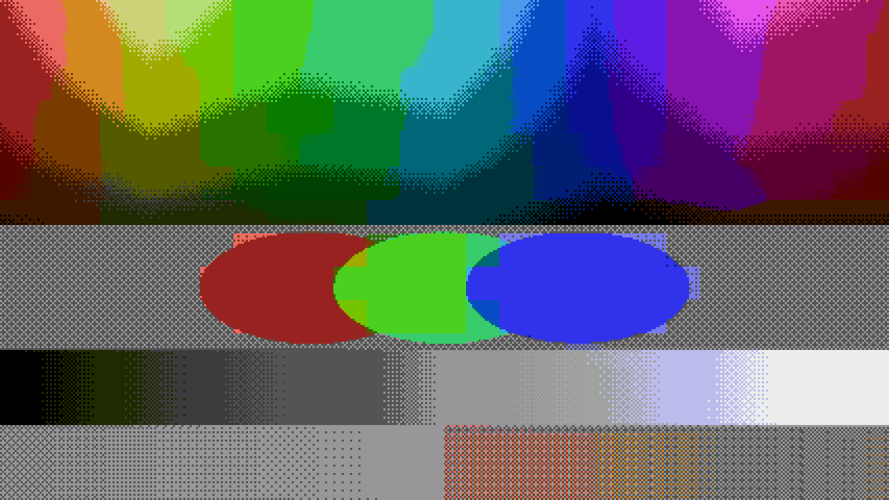
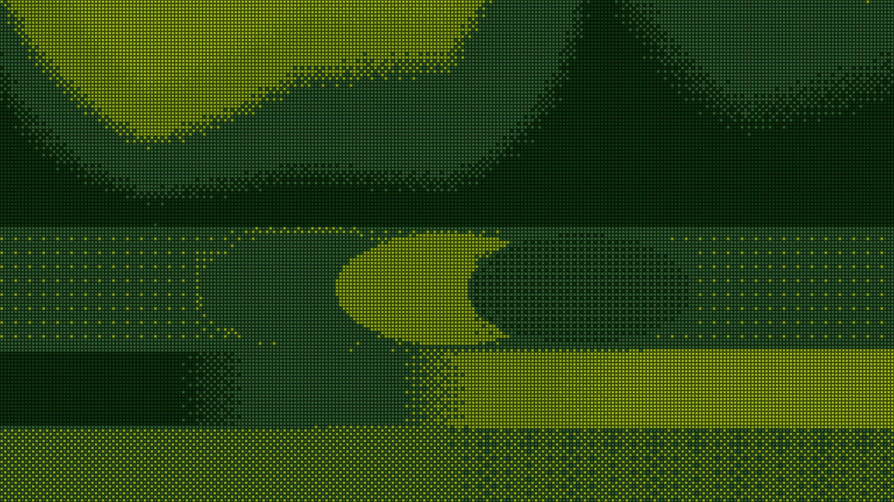
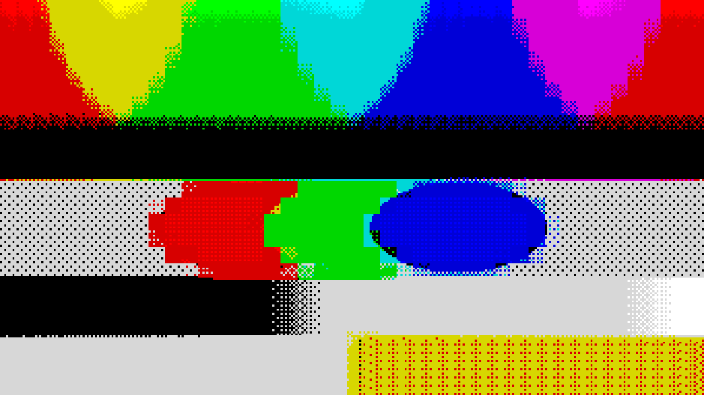
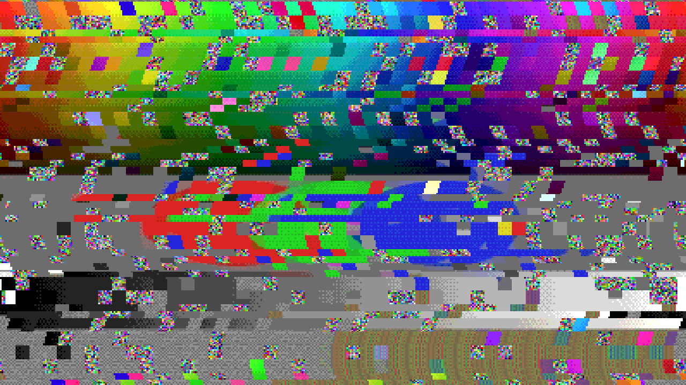

# NESolume

> **AI-assisted project.** This codebase was created with [Claude](https://claude.com/claude-code)
> (Anthropic), directed and reviewed by a human author. The chain has been
> verified numerically through an offline render harness that drives the real
> plugin class in a headless GL context — every rendered pixel is checked
> against its console's master palette even with corruption at full, every
> control is proven to change the picture, and presets render byte-identically
> to their hand-set values (see [Status](#status)). It has **not yet been
> loaded into Resolume**. Check it in your own rig before trusting it in a
> show.

Retro console video hardware for [Resolume](https://resolume.com) Arena and
Avenue, as an FFGL effect: the raster, the palette, the attribute cells — and
the ways they failed.



<sub>The harness test card through the NES: posterised into the 2C02 palette,
Bayer dither working the gradients, and the 16×16 attribute areas bleeding
hue exactly the way the hardware forced them to. All rendered by `netest`,
the repo's offline harness.</sub>

| | |
| --- | --- |
|  |  |
| Game Boy: four greens and the LCD cell grid | ZX Spectrum, Attribute Clash at full: one cell, one hue |



<sub>The same card through a Mega Drive whose VRAM has stopped being told the
truth: torn lines, displaced tiles, rotated palettes, garbage tiles — every
pixel still a colour the machine could produce.</sub>

NESolume is not a pixelate filter with a tint on it. It averages the picture
down onto a real machine's raster, forces it through that machine's colour
system with the attribute cells enforced, and scales it back up as fat
pixels. The recognisable artefacts are **consequences** of the constraints
rather than features that were drawn on:

| What you see | Why it happens |
| --- | --- |
| **Chunky dithered gradients** | The palette has a handful of levels, so an ordered dither trades resolution for colour — the same trade every 16-bit artist made by hand. |
| **Attribute clash** | An attribute cell could use one sub-palette, usually a ramp of one hue. Within a cell you keep your own brightness but not your own colour, so two objects crossing a cell bleed into each other. |
| **Glitches that stay in palette** | Corruption happens to the *indices*, before colour choice — a real glitch scrambled CRAM and tile pointers, not the DAC. Nothing a broken cartridge showed was ever outside the palette, and nothing here is either. |
| **Blocks and torn lines that land cleanly** | Displacement is scroll-register damage: whole raster pixels, whole tiles, wrapping around the edge the way a scroll register wraps. |

Two things follow from modelling it this way. The controls interact like the
hardware did — palette corruption on a Game Boy can only choose among four
greens, and attribute clash on a machine with a generous palette is mild
because the palette is generous. And everything is resolution-independent:
the expensive work runs at the console raster, so 4K costs barely more than
1080p.

## The consoles

| Console | Raster | Colour system | Attribute cell |
| --- | --- | --- | --- |
| **Custom** | 240 lines | 1–8 bits per channel, from the Colour Depth slider | 8×8 |
| **Game Boy** | 144 | the four DMG greens | 8×8 |
| **NES** | 240 | the 2C02's 64-entry master palette | 16×16 — the real attribute-area size, and why NES clash is so chunky |
| **ZX Spectrum** | 192 | 15 colours (8 basic, 7 bright) | 8×8 — the machine that made clash famous |
| **Commodore 64** | 200 | Pepto's 16 VIC-II colours | 8×8 |
| **Master System** | 192 | 2 bits per channel (64 colours) | 8×8 |
| **Mega Drive** | 224 | 3 bits per channel (512) | 8×8 |
| **SNES** | 224 | 5 bits per channel (32,768) | 8×8 |
| **PlayStation** | 240 | 5 bits per channel | 8×8 |

The raster is the console's line count; the width follows your composition's
aspect so pixels stay square on screen. Pixel Size scales the whole raster
from quarter-size pixels to four-times chunky, with native at the centre.

## Controls

Grouped in the inspector as **Picture**, **Distortion**, **Glitch** and
**Output**.

### Picture

| Control | What it is |
| --- | --- |
| **Console** | The machine. Sets the raster, the colour system and the attribute cell size. |
| **Pixel Size** | Raster scale. 0.5 is the console's native raster; up is chunkier. |
| **Colour Depth** | The Custom console's DAC, 1–8 bits per channel. The real consoles ignore it — their depth is in the table. |
| **Dither** | Ordered 4×4 Bayer, scaled to the quantisation step. |
| **Attribute Clash** | How strictly a cell shares its colours. 0 is per-pixel freedom; 1 is one hue per cell, Spectrum-style. |
| **Pixel Grid** | The dark boundary between fat pixels — an LCD's cell gaps. Fades itself out when pixels get too small on screen to have one. |

### Distortion

| Control | What it is |
| --- | --- |
| **Wave** | A sine on the horizontal scroll, per line, snapped to whole pixels — fine scroll had no fractional bits. |
| **Shake** | The whole frame knocked off its sync, re-rolled on the glitch clock. |

### Glitch

| Control | What it is |
| --- | --- |
| **Block Glitch** | Tile pointers reading the wrong address: whole attribute cells displaced by whole cells. |
| **Line Glitch** | Bands whose scroll register read back garbage: horizontal tears. |
| **Palette Glitch** | CRAM corruption: cells with their channels rotated or inverted *before* quantisation, so the result is wrong but legal. |
| **Garbage** | Tile pointers into memory that never held graphics: noise tiles, quantised like everything else. |
| **Glitch Rate** | How often the machine's luck changes. At 0 the corruption is a still — a crashed machine, not a screensaver. |

### Output

| Control | What it is |
| --- | --- |
| **Mix** | Wet/dry against the untouched input. |

**Preset** holds eight factory looks, from *Handheld* to *Kill Screen*.
Picking one copies its values into the sliders; touching a covered slider
hands control back to Custom.

## Install

Drop the plugin into Resolume's plugin folder and restart it:

- **macOS** — `~/Documents/Resolume Arena/Extra Effects/` (or `Resolume Avenue`)
- **Windows** — `%USERPROFILE%\Documents\Resolume Arena\Extra Effects\`

It appears in the effects list as **NESolume**.

## Build

```bash
git clone --recurse-submodules https://github.com/stoatworks-labs/nesolume.git
```

```bash
cmake -B build -DCMAKE_BUILD_TYPE=Release && cmake --build build
```

macOS produces a universal (arm64 + x86_64) `NESolume.bundle`; Windows a
`.dll`. `cmake --install build` drops the bundle straight into the Resolume
folder above.

## Looking at it without Resolume

`netest` renders the real chain to a PNG through a headless GL context. It
drives the actual plugin class through the actual FFGL entry sequence, so it
is testing the shipped code rather than a copy of it.

```bash
./build/netest --out /tmp/frame.png --width 1920 --height 1080
```

```bash
./build/netest --list
```

```bash
./build/netest --out /tmp/crash.png --set "Console=6" --set "Block Glitch=0.7" --set "Palette Glitch=0.6"
```

Its default test card is built to make wrong answers visible rather than to
look nice: a hue-by-brightness field for the palette, overlapping discs
crossing attribute cells for the clash, a grey ramp for the levels, a
single-pixel checkerboard for the downsample.

`--pipe` puts real footage through the chain instead, reading raw RGBA frames
from stdin and writing them to stdout:

```bash
ffmpeg -i in.mov -f rawvideo -pix_fmt rgba - | ./build/netest --pipe --width 1920 --height 1080 --script params.txt | ffmpeg -f rawvideo -pix_fmt rgba -s 1920x1080 -r 30 -i - out.mp4
```

`--script` is parameter automation — a text file of `frame  Parameter Name
value` lines, linearly interpolated between keys.

## Status

Verified through the offline harness on an M4 Max:

- **Every pixel is a legal colour of its console**, checked pixel-by-pixel
  against the master palettes with dither, clash and every corruption control
  switched on (`tools/verify.py`): all 4 Game Boy greens, 54 distinct NES
  colours out of the 2C02's 64 entries, all 15 Spectrum colours, all 16 C64
  colours, and the Custom console at 1 bit landing on exactly the 8 corners
  of the RGB cube.
- **All 15 controls demonstrably do something.** `tools/sweep.py` renders
  every parameter at both ends of its range and fails if any made no
  difference — the only way to catch a uniform name that does not match
  between the C++ and the GLSL, since that fails silently.
- **Presets are honest.** A preset renders byte-identically to setting its
  values by hand.
- **The chain is deterministic.** Two runs of the harness produce
  byte-identical frames; time comes from the host clock, so a re-render
  reproduces its glitches.
- **Cost is 0.17 ms/frame at 1080p and 0.56 ms at 4K.** The quantising runs
  at the console raster, so it barely scales with composition size. Both
  figures are from one machine, not from CI.

Not verified:

- **Never loaded into Resolume.** The parameter groups, the Console and
  Preset dropdowns, and Arena's real texture sizes and premultiplication
  behaviour are all unconfirmed — the harness supplies its own textures.
- **The Windows build has never been compiled.** No CI yet.
- **The universal macOS build has been built and `lipo`-verified, never run
  on an Intel machine.**

## Licence

MIT — see [LICENSE](LICENSE).

Built on the [Resolume FFGL SDK](https://github.com/resolume/ffgl).
