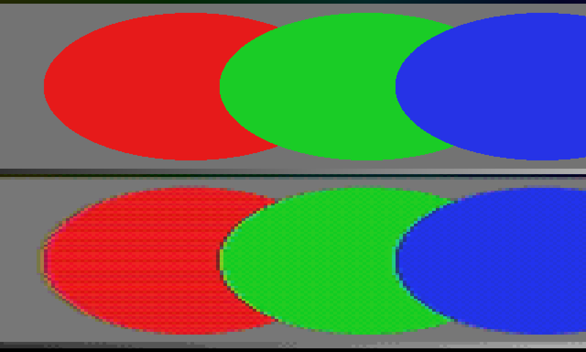

# NESolume — User Guide

NESolume puts a retro games console between your content and your output: a
real machine's raster, its palette, its attribute cells — and the ways all
three fail. It runs as an FFGL effect in Resolume Arena and Avenue, and as an
OpenFX plugin in DaVinci Resolve, Vegas Pro, Nuke and Natron.

*The harness test card through the NES: posterised into the 2C02 palette, Bayer dither working the gradients, and the 16×16 attribute areas bleeding hue exactly the way the hardware forced them to. Rendered by the plugin's own offline harness in a headless GL context, not a Resolume screen capture.*

It is not a pixelate filter with a tint. The picture is averaged down onto
the console's raster, forced through its colour system with the attribute
cells enforced, and scaled back up as fat pixels. Everything you recognise —
chunky dithered gradients, colours bleeding between objects, tiles landing in
the wrong places — is a consequence of those constraints, which is why heavy
settings read as a machine failing rather than a video effect succeeding.

## Install

**Resolume (FFGL):**

- **macOS** — copy `NESolume.bundle` into
  `~/Documents/Resolume Arena/Extra Effects/` (or `Resolume Avenue`), then
  restart Resolume. The build is universal (Apple Silicon + Intel).
- **Windows** — copy `NESolume.dll` into
  `%USERPROFILE%\Documents\Resolume Arena\Extra Effects\`, or run the
  installer.

It appears in the effects list as **SW NESolume**.

**Resolve and other OFX hosts:** copy `NESolume.ofx.bundle` into
`/Library/OFX/Plugins/` (macOS),
`C:\Program Files\Common Files\OFX\Plugins\` (Windows) or `/usr/OFX/Plugins/`
(Linux) and restart the host.

The macOS builds are **Developer ID-signed and notarised**, so both bundles just load. The
Windows builds are not code-signed, but plugin files are not gated the way `.exe` files are, so
the host loads them normally.

## Choosing a machine

The **Console** dropdown is the heart of the plugin. Each entry sets three
things at once: how many scanlines the machine drew, what colours it could
physically produce, and how big an attribute cell was — the area forced to
share colours.

| Console | Lines | Colours | Cell |
| --- | --- | --- | --- |
| Custom | 240 | set by Colour Depth, 1–8 bits per channel | 8×8 |
| Game Boy | 144 | the four DMG greens | 8×8 |
| NES | 240 | the 2C02's 64-entry master palette | 16×16 |
| ZX Spectrum | 192 | 15 colours | 8×8 |
| Commodore 64 | 200 | the 16 VIC-II colours | 8×8 |
| Master System | 192 | 64 (2 bits per channel) | 8×8 |
| Mega Drive | 224 | 512 (3 bits per channel) | 8×8 |
| SNES | 224 | 32,768 (5 bits per channel) | 8×8 |
| PlayStation | 240 | 32,768 (5 bits per channel) | 8×8 |
| Amiga | 256 or 200, doubled when laced | 12-bit registers: 32, 64 (EHB) or HAM6 | none |

The line count is the console's; the width follows your composition's aspect,
so pixels stay square on any output. **Pixel Size** scales the whole raster —
0.5 is native, up is chunkier, down is finer than the machine ever was.

Two things follow from the palette being real. Corrupted colours are still
that machine's colours — a glitched Game Boy can only choose among four
greens. And a generous palette clashes gently — the SNES has colours to
spare, the Spectrum does not, and the controls behave accordingly.

## The Amiga

New in v1.1.0, and the last entry in the Console list. Pick **Amiga** and the
controls in the **Amiga** group come alive (they do nothing on any other
console, and the machines above them are exactly as they were).

*The harness test card's discs, straight (top) and through HAM6 over the Fixed palette of sixteen greys (bottom): each disc's colour arrives over several pixels from its left edge, one gun at a time — the HAM fringe. Rendered by the plugin's own offline harness.*

Every colour the Amiga shows is a **12-bit register**: four bits a gun, 4,096
colours in all, so any gradient bands in sixteen steps per gun. How the
registers are used is the **Amiga Mode**:

- **OCS 32 Colours** — 32 registers, chosen for the picture. A clean,
  posterised look; the classic Deluxe Paint screen.
- **Extra Half-Brite** — the same 32, plus each one at exactly half
  brightness (every gun shifted right one bit), for 64. Shadows and dark
  versions of every colour come free; the dark twins are always exactly half.
- **HAM6** — hold-and-modify. Each pixel is either one of 16 registers or
  **the pixel to its left with one gun changed**. A picture gets thousands of
  colours, but a hard edge between two unrelated colours cannot arrive in one
  step: it takes at least three pixels, one gun each, and the encoder often
  spreads it wider because that looks closer to the picture. The result is
  the smear of colour trailing to the right of every sharp edge that HAM is
  famous for. It is strongest on hard-edged graphics and saturated colours
  over a contrasting ground; soft footage mostly just gains colours.

**Screen Mode** picks the Amiga's screen: **PAL Low Res** (320 × 256 at 50 Hz,
the default), **NTSC Low Res** (320 × 200 at 60 Hz), and the two **High Res**
screens at 640 wide. The picture is the Amiga's own raster stretched to your
composition, as a monitor set to fill would show it, so the pixels are not
square — a HAM line being 320 pixels long is the constraint, so the plugin
keeps it. High res has sixteen colours in every mode: the chipset could only
fetch four bitplanes there, so Extra Half-Brite and HAM6 did not exist in high
res, and do not here. (Pixel Size still scales the raster.)

**Interlace** doubles the lines — 512 PAL, 400 NTSC — and, like the real
thing, shows them as two fields of alternate lines, 50 or 60 a second, timed
from real elapsed time. Anything one line high is in one field and missing
from the next, so fine horizontal detail flickers at 25 or 30 Hz and edges
twitter up and down a line. **Flicker Fixer** is the cure Amiga owners bought:
both fields woven into one steady full-height frame. It does nothing unless
Interlace is on.

> **A note on flicker.** Laced mode is a 25 Hz (PAL) or 30 Hz (NTSC) flicker by
> design, which is inside the band that can trigger photosensitive epilepsy.
> On Resolume's own demo clips it is small — measured field to field at most
> 0.8% of white over the whole frame and 3.8% in the worst small block — but a
> picture made of thin horizontal lines (text, a grille, a laced Workbench)
> flickers much harder. Check laced footage before it goes on a big screen,
> and use Flicker Fixer or leave Interlace off when in doubt.

**Amiga Palette** chooses the registers:

- **Per Frame** (the default) — chosen for each picture, the way a paint
  program or converter would, by clustering the picture's colours in 12-bit
  space. Each frame starts from the last frame's choice, so on moving footage
  the palette drifts with the picture instead of jumping.
- **Fixed** — one set that never changes: sixteen greys for HAM6 (which
  makes the fringes most visible, since every colour then has to be built by
  modification), and a fixed 32 (or 16 in
  high res) for the others. Choose it when you want no palette movement at all.

The other controls still apply. **Dither** works as on every machine (for
HAM6 at one 12-bit step). The glitches still corrupt the picture *before*
any colour is chosen, so a failing Amiga shows wrong colours, never illegal
ones. **Attribute Clash** does nothing: the Amiga had no attribute cells.

The Amiga is in the Resolume (FFGL) plugin only; the OpenFX build for Resolve
and friends does not have it.

## The Picture controls

- **Colour Depth** — the Custom console's DAC, 1 bit per channel (8 colours)
  to 8 (16 million). The named consoles ignore it; their depth is history's.
- **Dither** — ordered 4×4 Bayer dither, scaled to the quantisation step.
  This is the trade every 16-bit artist made by hand: resolution spent on
  colour. Turn it off for hard posterised bands, up for the classic chequered
  gradients.
- **Attribute Clash** — how strictly an attribute cell shares its colours.
  Within a cell you keep your own brightness but not your own colour: at 0
  every pixel chooses freely, at 1 the cell speaks with one hue and two
  objects crossing it bleed into each other, Spectrum-style. The NES's
  16×16 cells make its clash the chunkiest.
- **Pixel Grid** — the dark boundary between fat pixels, an LCD's cell gaps.
  It fades itself out when a raster pixel is too small on screen to have a
  boundary worth drawing, so it is safe to leave up.

## Distortion and Glitch

All of the damage is *scroll-register damage*: it moves which raster pixel is
shown where, in whole pixels, wrapping around the edge the way a scroll
register wraps. None of it invents colours.

- **Wave** — a sine on the horizontal scroll, per line. Snapped to whole
  pixels, because fine scroll had no fractional bits.
- **Shake** — the whole frame knocked off its sync.
- **Block Glitch** — tile pointers reading the wrong address: whole attribute
  cells displaced by whole cells.
- **Line Glitch** — bands whose scroll register read back garbage:
  horizontal tears.
- **Palette Glitch** — CRAM corruption. Affected cells have their colour
  channels rotated or inverted *before* the palette lookup, so the result is
  wrong but always legal.
- **Garbage** — tile pointers into memory that never held graphics: noise
  tiles, quantised through the same palette as everything else.
- **Glitch Rate** — how often the machine's luck changes. Each tick re-rolls
  which cells and bands are corrupted. **At 0 the corruption is a still** — a
  crashed machine, not a screensaver — which is exactly what you want for a
  freeze-frame look. Winding the control down to 0 holds the glitch that is on
  screen at that moment, so you can ride it down onto a frame you like rather
  than being given whichever one zero happens to land on.

**Mix** is a wet/dry against the untouched input. Note the effect snaps
transparency to one bit (console video had transparency or it did not); Mix
is how you bring soft edges back if you need them.

## Presets

The **Preset** dropdown holds eight factory machines-in-states, from
*Handheld* (a healthy Game Boy, grid up) through *Front Room NES* and
*Attribute Clash* (the Spectrum at full strictness) to *Dirty Cartridge*,
*Corrupted VRAM* and *Kill Screen*. Picking one copies its values into the
sliders; touching any covered slider hands control back to Custom. Mix is
never covered — how much of the effect is in the programme is yours.

## Performance

The expensive work runs at the console raster regardless of composition
size: about 0.17 ms per frame at 1080p and 0.56 ms at 4K on an Apple M4 Max.
Chunkier pixels are cheaper still.

The Amiga costs more, because it chooses its registers on the CPU every frame
and HAM6 is encoded on the CPU: GUIDE_PERF

## If the effect does nothing

The one real failure mode is a shader that would not compile on your GPU
driver, which Resolume shows as an effect that silently does nothing. The
plugin writes a log that names the failing stage:

- **macOS** — `~/Library/Logs/nesolume/`
- **Windows** — `%LOCALAPPDATA%\nesolume\logs\`

Include that file in any bug report:
<https://github.com/stoatworks-labs/nesolume/issues>.
